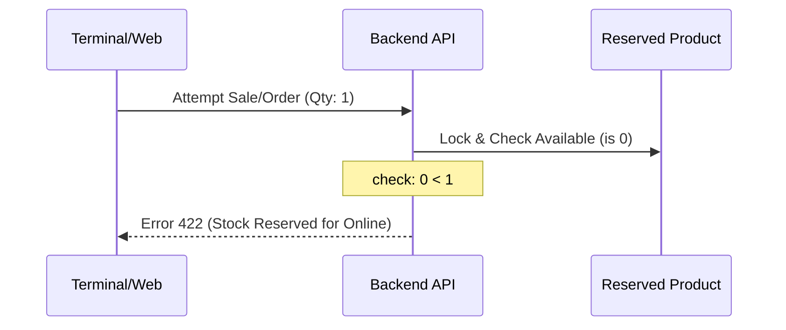

# Inventory & Fulfillment Audit: Strict Reservation Integrity
**Date**: March 28, 2026
**Author**: Deshio V2 System Architect (Antigravity)

## 1. Executive Summary
This audit documents the refined inventory management system for Deshio V2. The primary objective is to ensure data integrity and prevent overselling by strictly protecting online reservations. All transactions, including Physical Point of Sale (POS) and Counter sales, are subject to global availability checks. If `available_inventory` reaches 0, no further sales (online or physical) are permitted until stock is replenished or reservations are released. This ensures that customers who have already purchased or reserved items online are guaranteed fulfillment.

---

## 2. Core Architectural Components

### 2.1 The ReservedProduct Model
The `ReservedProduct` model is the central source of truth for global inventory availability across all branches.

- **total_inventory**: The sum of all quantities across all physical batches (`ProductBatch`) in all stores.
- **reserved_inventory**: The sum of quantities across all pending online orders (`OrderItem`) that have not yet been physically fulfilled.
- **available_inventory**: Calculated as `total_inventory - reserved_inventory`. This value is **strictly non-negative** (capped at 0).

### 2.2 System Observers
Two primary observers synchronize the `ReservedProduct` data in real-time:

1.  **OrderItemObserver**:
    - **Trigger**: When an `OrderItem` is created, updated, or deleted for a `pending` or `pending_assignment` order.
    - **Action**: Increments/Decrements the `reserved_inventory` and inversely updates `available_inventory`.
2.  **ProductBatchObserver**:
    - **Trigger**: When a `ProductBatch` is saved (quantity changes) or deleted.
    - **Action**: Recalculates `total_inventory` and updates `available_inventory` (using `max(0, ...)`).

---

## 3. Strict Reservation Integrity Flow

### 3.1 Unified Stock Verification
All order types—including Counter (POS), Social Commerce, and E-commerce—must adhere to the same global availability rules.

1.  **Stock Verification**: Before any order is created, the system locks the `ReservedProduct` record for the requested product.
2.  **Global Enforcement**: The value of `available_inventory` is checked against the requested quantity.
3.  **Blocking Logic**: If `available_inventory < quantity`, the sale is blocked immediately. This applies even to physical customers at the counter if their purchase would consume stock already promised to an online customer.

### 3.2 Inventory Impact
- Upon successful order creation, `reserved_inventory` increases.
- `available_inventory` decreases (but never below 0).
- For Counter orders, stock is deducted immediately from the `ProductBatch`, and the reservation is released simultaneously (via scanning/fulfillment logic).

---

## 4. Fulfillment Scanning Optimization

### 4.1 Problem Identification
Previously, the system enforced a strict `batch_id` match between the reservation and the scanned barcode. This caused 422 errors when batch assignments were null or when staff picked from a different batch.

### 4.2 Solution Implementation
The `StoreFulfillmentController@scanBarcode` method has been refactored to prioritize physical location.

- **Store Verification**: Verified barcode is physically present in the employee's store.
- **Product Verification**: Verified barcode matches the `product_id` of the order item.
- **Batch Relaxation**: The `order_item`'s `product_batch_id` is updated on-the-fly to match the batch associated with the physical barcode scanned.

---

## 5. Sequence Diagram: Stock Locking

---

## 6. Edge Case Analysis

| Scenario | Handling | Impact |
| :--- | :--- | :--- |
| **Online Order Cancel** | `OrderItemObserver@deleted` triggers. | `reserved_inventory` decreases, `available_inventory` increases (up to total). |
| **POS Return** | `ProductBatch@saved` triggers. | `total_inventory` increases, `available_inventory` increases. |
| **Store Transfer** | Barcodes move between stores. | Fulfillment scanning verifies new `current_store_id`. Global reservation remains unaffected. |
| **Stock Discrepancy** | Physical count < Digitally Reserved. | POS sales are blocked until the inventory record is corrected or reservations are cancelled. |

---

## 7. Modified Files
- `StoreFulfillmentController.php`: Relaxed barcode scanning constraints.
- `OrderController.php`: Strictly enforces global availability for all order types.
- `ProductBatchObserver.php`: Ensures `available_inventory` remains non-negative.
- `OrderItemObserver.php`: Maintains global reservation integrity.

---

## 8. Conclusion
The current inventory system prioritizes the integrity of online promises. By strictly enforcing reservations and prohibiting negative inventory, Deshio V2 guarantees that once an item is purchased or reserved online, it is digitally locked and unavailable for physical sale at any storefront until the online order is either fulfilled or cancelled.

---
*End of Audit Report*
