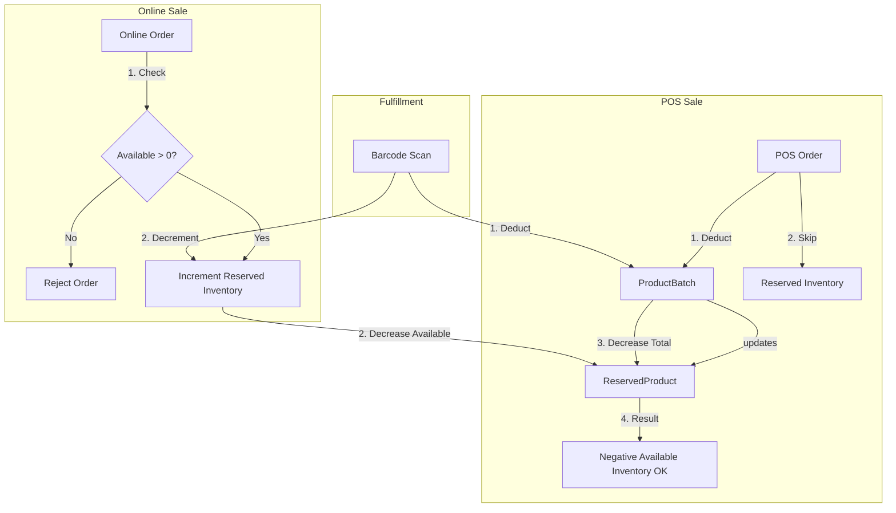

# Inventory Integrity & Sales Priority Audit Report (29-Mar-2026)

## Overview
This audit examines how the Deshio V2 system handles inventory across three distinct sales channels: **POS (Counter Sale)**, **Social Commerce**, and **E-commerce**. The goal is to ensure POS sales take priority over online reservations and that the system accurately reflects over-committed stock by allowing `available_inventory` to go negative.

## Current System Architecture

### 1. Inventory Model (`ReservedProduct`)
The system uses a centralized `ReservedProduct` table to track global stock state:
- **`total_inventory`**: Sum of quantities in all physical `ProductBatch` records.
- **`reserved_inventory`**: Stock committed to `pending` or `pending_assignment` online orders (Social/E-commerce).
- **`available_inventory`**: Stock that can be sold online. Currently calculated as `total_inventory - reserved_inventory` (capped at 0).

### 2. Inventory Logic Flow

#### A. E-commerce / Social Commerce Order Creation
- **Controller**: `EcommerceOrderController@createFromCart` / `OrderController@create`.
- **Constraint**: Blocks order if `available_inventory < requested_quantity`.
- **Reservation**: `OrderItemObserver` increments `reserved_inventory` when an `OrderItem` is created for a `pending` order.
- **Result**: Decreases `available_inventory`.

#### B. POS (Counter) Order Creation
- **Controller**: `OrderController@create` (order_type = `counter`).
- **Constraint 1**: Checks local `ProductBatch` quantity.
- **Constraint 2**: **(BUG)** Currently checks `available_inventory` and blocks sale if online orders have reserved the stock.
- **Deduction**: Immediately decrements `ProductBatch` quantity.
- **Observation**: `ProductBatchObserver` updates `total_inventory`.
- **Double Deduction (BUG)**: POS orders currently have status `pending`, which triggers `OrderItemObserver` to ALSO increment `reserved_inventory`.

#### C. Online Order Fulfillment
- **Controller**: `StoreFulfillmentController@scanBarcode`.
- **Deduction**: Decrements `ProductBatch`.
- **Release**: Decrements `reserved_inventory`.

---

## Identified Issues & Critical Bugs

### 1. POS Double Deduction (Critical)
When a POS order is created:
1. Physical stock is deducted from the batch -> `total_inventory` drops.
2. `OrderItemObserver` sees status `pending` -> `reserved_inventory` rises.
3. `available_inventory` drops **twice** for the same sale.
   - Example: 10 in stock, 0 reserved. POS sells 2.
   - `total` becomes 8. `reserved` becomes 2.
   - `available` becomes 8 - 2 = 6. (Should be 8).

### 2. POS Stock Blocking (Mandate Violation)
The `OrderController@create` method explicitly blocks POS sales if global reservations are high.
- Example: 10 in stock, 10 reserved for online. `available` = 0.
- POS tries to sell 2 units physically present in the store.
- **Current result**: "Cannot sell... Stock is reserved for online orders."
- **Requested result**: POS should sell, `total` becomes 8, `available` becomes -2.

### 3. `max(0, ...)` Calculation Error
The `ProductBatchObserver` and `StoreFulfillmentController` both use `max(0, ...)` when calculating `available_inventory`. This hides the fact that the system is over-committed and prevents online sales from being blocked correctly when POS "steals" their stock.

---

## Technical Diagram: Inventory Flow



---

## Suggested Fixes

### 1. Update `OrderController.php`
Modify the `create` method to bypass the global inventory check for `counter` orders.

```php
// Deshio_be/app/Http/Controllers/OrderController.php

// Find the global check block:
if ($batch) {
    if ($batch->quantity < $itemData['quantity']) {
        throw new \Exception("Insufficient local stock for {$product->name}. Available: {$batch->quantity}");
    }
    
    // CHANGE: Wrap the global check
    if ($request->order_type !== 'counter') {
        $reservedRecord = \App\Models\ReservedProduct::where('product_id', $product->id)->lockForUpdate()->first();
        $globalAvailable = $reservedRecord ? $reservedRecord->available_inventory : 0;
        
        if ($globalAvailable < $itemData['quantity']) {
            throw new \Exception("Cannot sell {$product->name}. Stock is reserved for online orders.");
        }
    }
}
```

### 2. Fix Double Deduction in `OrderItemObserver.php`
Ensure POS items do not increment the reservation counter.

```php
// Deshio_be/app/Observers/OrderItemObserver.php

public function created(OrderItem $orderItem): void
{
    $order = $orderItem->order;
    // ADD: Check order_type
    if ($order && $order->order_type !== 'counter' && in_array($order->status, ['pending_assignment', 'pending'])) {
        $this->incrementReservation($orderItem->product_id, $orderItem->quantity);
    }
}
```

### 3. Enable Negative Inventory in `ProductBatchObserver.php`
Remove the `max(0, ...)` constraint.

```php
// Deshio_be/app/Observers/ProductBatchObserver.php

protected function syncReservedProduct(int $productId): void
{
    $total = ProductBatch::where('product_id', $productId)->sum('quantity');
    // ...
    $reservedProduct->total_inventory = $total;
    // CHANGE: Allow negative
    $reservedProduct->available_inventory = $total - $reservedProduct->reserved_inventory;
    $reservedProduct->save();
}
```

### 4. Update `StoreFulfillmentController.php`
Same change as above for the manual scan logic.

---

## Integrity Check Examples

| Scenario | Total | Reserved | Available | Action | Result |
| :--- | :--- | :--- | :--- | :--- | :--- |
| **Initial** | 10 | 0 | 10 | - | - |
| **Online Order** | 10 | 2 | 8 | Reserving | Correct |
| **POS Sale (3)** | 7 | 2 | 5 | Physical Deduction | Correct (Bypasses check) |
| **Online Reservation (6)**| 7 | 8 | -1 | Reserving | Correct (Over-committed) |
| **Online Order (1)** | 7 | 8 | -1 | Reject | Correct (Blocked because < 0) |
| **Fulfillment** | 6 | 7 | -1 | Scan 1 unit | Correct (Both drop) |

## Edge Cases

1. **Simultaneous POS & Online Sale**:
   - Database transactions and `lockForUpdate()` in `OrderController` protect against race conditions.
   - POS will always succeed if local batch exists.

2. **Order Cancellations**:
   - `OrderObserver` correctly handles `reserved_inventory` release.
   - If an online order is cancelled after a POS sale took its stock, `available_inventory` will recover towards 0 or positive.

3. **Pre-Orders**:
   - Pre-orders (no batch) skip these checks entirely and do not affect `total_inventory`, which is correct.

## Conclusion
The current implementation fails to prioritize POS sales and contains a double-deduction bug that corrupts the `available_inventory` metric. Implementing the suggested fixes will restore system integrity and fulfill the business requirement of prioritizing physical counter sales.
